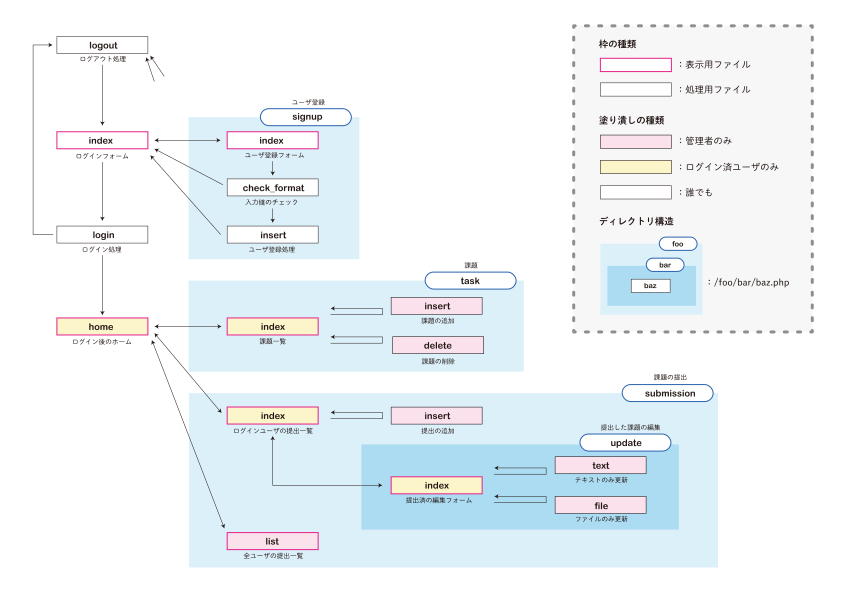

# PHPの課題提出サイトデモ

PHPの練習として作成した課題提出サイト。

## セットアップ

`common/env.sample.php`のファイル名を`common/env.php`という名前でコピーし、自分の環境にあったように書き換える。

## 補足説明

* [https://michin0suke.github.io/php-sample-task/](https://michin0suke.github.io/php-sample-task/)

## ディレクトリ構造

