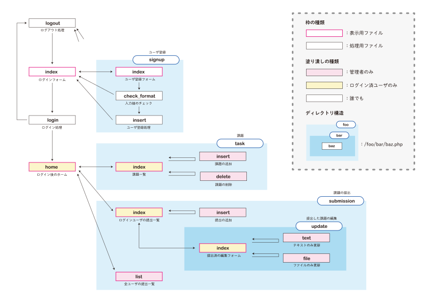

# 補足説明


## 考え方

### ファイル構造

`<form></form>`のactionを指定せずにPOSTやGETをそのファイル自身に送る設計だと、一つのファイル上部にPHPのロジック処理、ファイル下部にHTMLの表示となって可読性が下がります。

また、ユーザがリロードやブラウザバックをするたびにPOSTが送信され処理が発生するので、リロードするたびにデータベースにレコードが追加されるなどの問題も発生します。

そこで、**与えられた情報を表示するのビューファイル**と、**計算してリダイレクトするロジックファイル**を意識的に分けることで、ファイルごとの役割が明確になって可読性が上がります。 

ロジックファイルは出力を行わずリダイレクトするので、**ユーザからはビューファイルしか存在しないように見えます。**





### if文とガード節

複数の条件があるとき、if文は入れ子（if文の中にif文）の状態になります。

```php
<?php
$name = $_POST['name'];

if (isset($name)) {
    if ($name !== '') {
        if (strlen($name) > 2) {
            echo $name;
        } else {
            die('nameが短すぎます。');
        }
    } else {
        die('nameが空です。');
    }
} else {
    die('nameが渡されていません。');
}
```

ネストが深くなる（何重にも入れ子になる）と、とても可読性が低くなります。以下のように書くことを検討してください。ガード節といいます。

```php
<?php
$name = $_POST['name'];

if (!isset($name)) die('nameが渡されていません。');

if ($name === '') die('nameが空です。');

if (strlen($name) > 2) die('nameが短すぎます。');

echo $name;
```


### エスケープは最後の最後で

可読性が下がるので、エスケープした文字列を変数に入れないでください。

```php
// こういうのダメ
$ str = htmlspecialchars($str, ENT_QUOTES, 'UTF-8');
$ sql = mysqli_real_escape_string($db, $sql);
```


### エスケープはラッパー関数を作る

エスケープは表示する段階で、と言いましたが、毎回`htmlspecialchars(hogehogehogehoeg)`とHTML内に書いていると可読性が下がるので、ラッパー関数を作成しましょう。

ラッパー関数とは、関数を包んだ（ラップした）関数のことです。

```php
// SQLエスケープ
function s($str) {
    // globalを使うと関数の外の変数が使える
    global $db;
    return $db -> escapeString($str, ENT_QUOTES);
}

// HTMLエスケープ
function h($str) {
    return htmlspecialchars($str, ENT_QUOTES, 'UTF-8');
}
```

こういうのをラッパー関数と言います。すると、以下のように書けます。

```php
// ラッパー関数を使わない場合
<p><?=htmlspecialchars($record['name'], ENT_QUOTES, 'utf-8')?></p>
  
// ラッパー関数を使う
<p><?=h($record['name'])?></p>
```


### データベースというものについて

データベースは単にデータを保存するためだけのものではなく、**データの整合性を保証するため**のものです。アプリケーションでユーザ名が重複しないと決めているのに、データベースでユーザ名の重複が許容されていれば、整合性を保証できません。


### 命名規則について

例えば`task.php`というページからデータを渡して、データベースにinsertするファイルを作成するなら、ファイル名は`insert.php`ではなく`task_insert.php`や、サブディレクトリを作成して`task/insert.php`いう名前にするべきです。なぜなら、ファイル名だけを見たときに、何をinsertするのか分からないからです。

変数やファイルの名前は可読性に大きな影響を与えるので、Google翻訳を使用するなどして、慎重に命名しましょう。

慣例的に決まっているものの例を以下にあげます。

* データベースのテーブル名 : 複数形 / 小文字 / スネークケース`users`, `posts`
* データベースの主キー : 基本的に`id`
* データベースの外部キー : `[参照先のテーブル名の単数形]_id` (`user_id`とか)
* データベースの作成日時のカラム名 : `created_at`
* データベースの更新日時のカラム名 : `updated_at`
* 論理値を返す関数や、論理値が入っている変数 : isをつける`is_admin`, `isset()`


## スニペット


### データベース

MySQLはセキュリティがしっかりしている代わりに共有が難しいので、一つのファイルでデータベースを管理できる**SQLite**というリレーショナルデータベースも使用できます。


#### 接続

```php
// MySQL
$db = mysqli_connect('localhost', 'root', 'secret', 'test_db') or die('MySQLサーバに接続できませんでした。');
mysqli_set_charset($db, 'utf8');

// SQLite
class MyDB extends SQLite3 {
    function __construct() {
        $this -> open('seminar.sqlite3');
    }
}
$db = new MyDB();
if(!$db) die('接続失敗です。'.$sqlite_error);
```


#### SQLクエリの発行

```php
$sql = 'SELECT * FROM some_table';

// MySQL
$records = mysqli_query($db, $sql);

// SQLite
$records = $db->query($sql);
```


#### レコードの取得

```php
// MySQL
$record = mysqli_fetch_assoc($records);

// SQLite
$record = $records -> fetchArray();

// 共通
echo $record['id'];
```


#### prepared statement

あらかじめSQLの雛形を作って、そこに変数を入れるというSQLクエリの書き方です。SQLインジェクション対策ができたり、キャッシュが効いたりします。

外部の変数をSQLに埋め込む場合に使用しましょう。

```php
$id = $_POST['id'];
$sql = 'SELECT * FROM some_table WHERE id = :id';
$stmt = $db -> prepare($sql);
$stmt -> bindValue(':id', $id, SQLITE3_INTEGER);
$records = $stmt -> execute() or die('エラー');
```


### ??

POSTやGETなどで渡された、**存在するか分からない値**を取得するのに便利です。

```php
$action = $_POST['action'] ?? 'default';

// 上の文は、この if/else 文と同じ意味です
if (isset($_POST['action'])) {
    $action = $_POST['action'];
} else {
    $action = 'default';
}
```


### セッションタイムアウト

セッション情報の保持時間を設定できます。

```php
// セッションの持続時間をすぎると、100%の確率でセッション情報を削除する
ini_set('session.gc_divisor', 1);

// セッションの持続時間の設定(15分の場合)
ini_set('session.gc_maxlifetime', 900);

// セッションの開始
session_start();
```


### header()

header関数の前には、出力があってはダメです。以下はダメな例です。

```php
<?php
echo 'a';
header('Location: index.php');
```

```php
<?php
<!DOCTYPE html>
header('Location: index.php');
```

